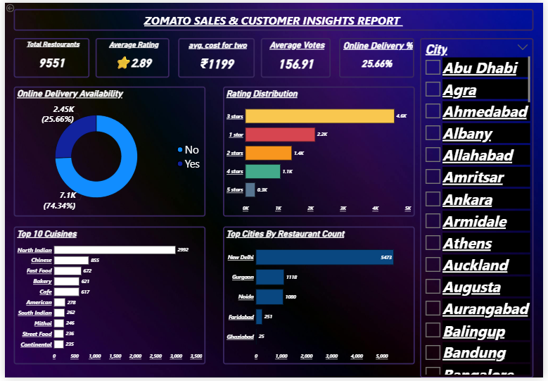

# 🍕 Zomato Sales & Customer Insights

## 📌 Project Overview
This project performs a complete end-to-end data analysis pipeline
on Zomato restaurant data — from raw data cleaning to an interactive
Power BI dashboard — covering 9,551 restaurants across multiple cities.

## 🛠️ Tech Stack
| Tool | Purpose |
|------|---------|
| Python (Pandas) | Data Cleaning & Transformation |
| Jupyter Notebook | Development Environment |
| MySQL | Data Storage |
| Power BI | Dashboard & Visualization |
| GitHub | Version Control |

## 🔄 Project Workflow
1. **Raw Data** → Received Excel dataset (.xlsx)
2. **Data Cleaning** → Cleaned using Python & Pandas in Jupyter Notebook
3. **Database** → Loaded cleaned data into MySQL using pandas to_sql()
4. **Visualization** → Connected Power BI to MySQL and built dashboard

## 📊 Dashboard Highlights
- Total Restaurants analyzed: **9,551**
- Average Rating: **2.89**
- Average Cost for Two: **₹1,199**
- Online Delivery availability: **25.66%**
- Top City: **New Delhi** with 5,473 restaurants
- Most popular cuisine: **North Indian** (2,992 restaurants)

## 📁 Repository Structure
├── NOTEBOOKS/      # Jupyter Notebook for data cleaning & MySQL loading
├── DATA/           # Raw and cleaned datasets
├── POWERBI/        # Power BI dashboard file (.pbix)
└── ASSETS/         # Dashboard screenshot

## ▶️ How to Run This Project
1. Clone the repo:
   git clone https://github.com/manishsehrawat0111/zomato-sales-insights.git

2. Open NOTEBOOKS/python+mysql+powerbi.ipynb in Jupyter

3. Update your MySQL credentials in the notebook:
   host = "localhost"
   user = "pandas"
   password = "pandas"
   database = "pandasdb"

4. Run all cells — this will clean the data and
   load it directly into MySQL via pandas to_sql()

5. Open POWERBI/zomato_dashboard.pbix in Power BI Desktop

## 📬 Contact
Manish Sehrawat — (https://www.linkedin.com/in/manish-sehrawat-ms/) — manishsehrawat0111@gmail.com
